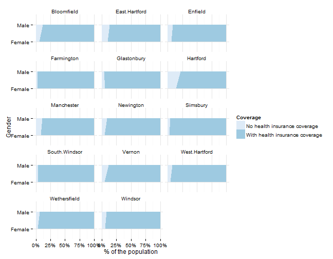
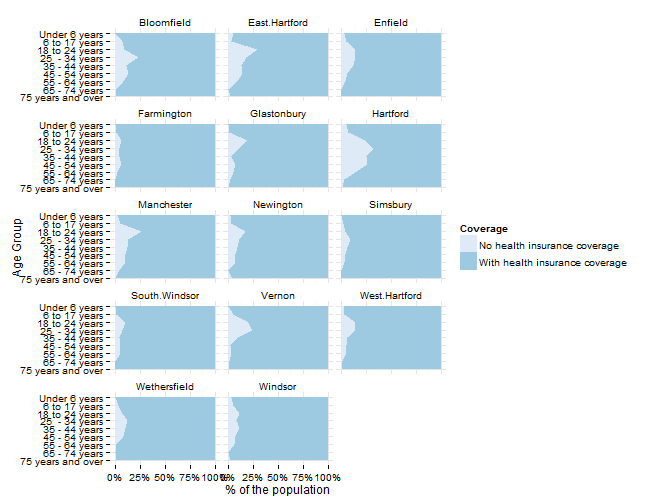
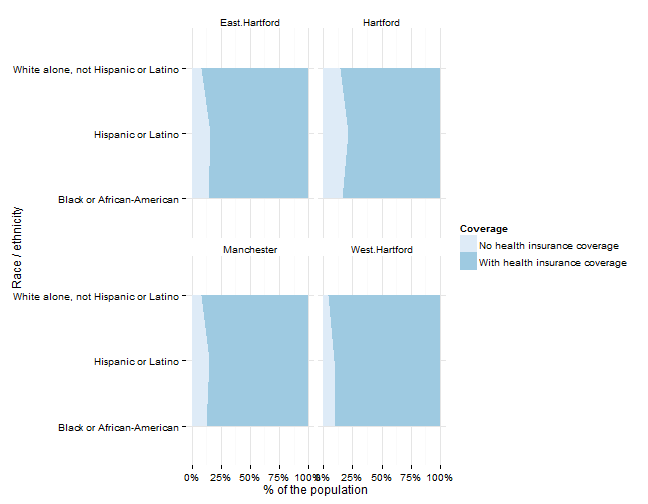
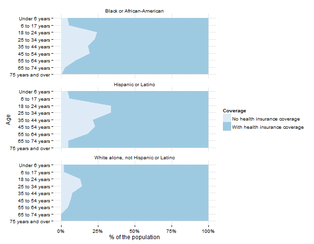

## Health insurance indicators

Indicators related to health insurance access and coverage will be covered here, primarily the percent of the population with health insurance (which scored highly in the survey).

## Data and limitations

Data on health insurance coverage is largely available from two sources, both with limitations for local indicators: the U.S. Census Bureau's American Community Survey, the annual sample survey and the Center for Disease Controls Behavioral Risk Factors Surveillance System (BRFSS). 

BRFSS data are available at the state-level and for [metro- and micro-politan statistical areas](http://www.cdc.gov/brfss/gis/gis_maps.htm). In the case of Hartford, the metro area includes the entirety of Hartford, Tolland and Middlesex counties, meaning the results are representative for those three counties together. Maps for indicators are available, but the three metro areas in Connecticut [show little variation](http://apps.nccd.cdc.gov/gisbrfss/map.aspx).

For ACS data, health insurance coverage data is primarily available from the ACS 1-year and 3-year estimates, which excludes [towns with fewer than 20,000 people](http://www.census.gov/acs/www/guidance_for_data_users/estimates/) - most of Tolland County and several towns in Hartford County. Data for the metro area or counties is available, but this masks disparities within these regions. Given this limitation, some basic data is still reviewed below.

## What do we already know?

Below are references for some local, regional and national reports that use health insurance indicators, with some details on how the data is used. 

### Local

* [CT Kids Report Card](http://www.cga.ct.gov/kid/rba/results.asp) has 'children with health insurance' as an indicator.
* [Pioneer Valley State of the People](http://pvpc.org/resources/datastats/state-of-people/stateofthepeople2013.pdf) includes % of households with health insurance in their 'Health and Safety' domain, using data from the CDC's [Behavioral Risk Factors Surveillance System ](http://apps.nccd.cdc.gov/brfss/list.asp?cat=HC&yr=0&qkey=8031&state=CT).
* [Population Results Working Group](http://www.ct.gov/opm/cwp/view.asp?a=2998&Q=490946) includes the 'Percent of CT residents without health insurance' as an indicator, but draws data from the Department of Insurance, instead of the Census. 
* [Data Haven's Community Well-Being Index](http://www.ctdatahaven.org/communityindex) includes the '% of adults 18+ with health insurance' in their index, along with a community health needs assessment. The Greater New Haven region had about 90 percent coverage, about the same as for metro Hartford (91%). The report describes barriers to healthcare in more detail and will be followed with an appendix on access to insurance later in the year. 
* [KidsCount](http://www.cahs.org/kidscount.asp) includes HUSKY A and B child enrollment    data from DSS as an indicator in their Connecticut Data Book. 
* [CT Voices for Children](http://www.ctvoices.org/) plans to include uninsured children as an indicator of 'Family Economic Security.' 

### Other relevant efforts

* [The Child Well-Being Index](http://fcd-us.org/our-work/child-well-being-index-cwi) includes the rate of children with health insurance as one indicator of family economic well-being. 
* [The Rhode Island Community Foundation](http://www.rifoundation.org/CommunityLeadership/CommunityDashboard/tabid/1157/Default.aspx) looks at the % of households with health insurance in their 'Health' domain at the state level, also using data from the CDC's BRFSS. 
* [What Matters to Metros](http://www.futurefundneo.org/whatmatters) includes the Percentage of the population who have health insurance as a factor in their model.

Some data on HUSKY enrollment is published via the [CTData portal](http://ctdata.org/catalog#), but the information available is from 2005 or 2007 at the latest. CT Voices for Children houses more recent data and provides regular analysis on HUSKY. 

## Sample results

For individual towns with data available, we can look at health insurance coverage with a few demographic breakouts. First, coverage rates by gender - coverage appears lower among males in all towns, with the lowest rates in Hartford and East Hartford. 

 

Similarly, data by age shows higher rates for the uninsured for 18 - 34 year olds in most towns in the region. 

 

For towns with sufficient data, we can look at coverage by race / ethnicity. (The four towns below are the only towns with sufficient data for each of the race / ethnicity groups to meet the ACS data quality requirements.)

 

Similarly, we can look at age groups by race for the region to identify subgroups with lower coverage rates. 

 

